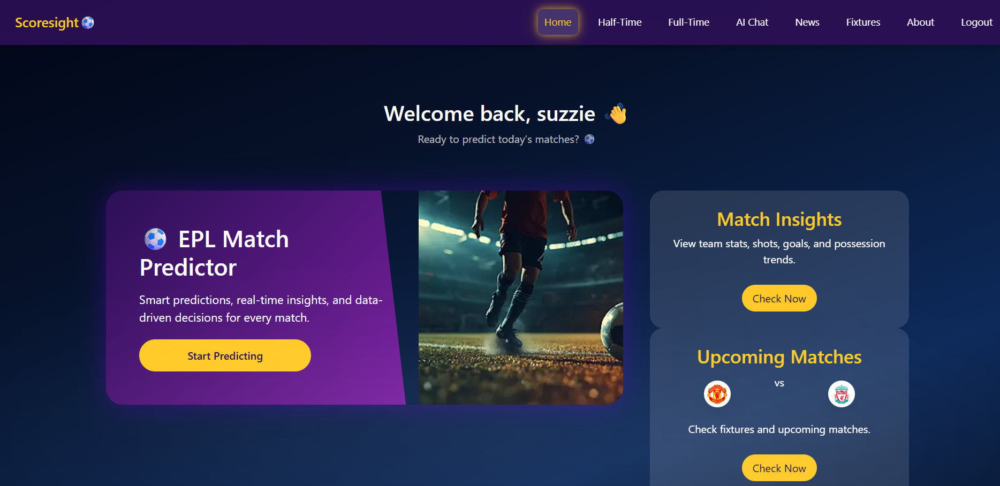
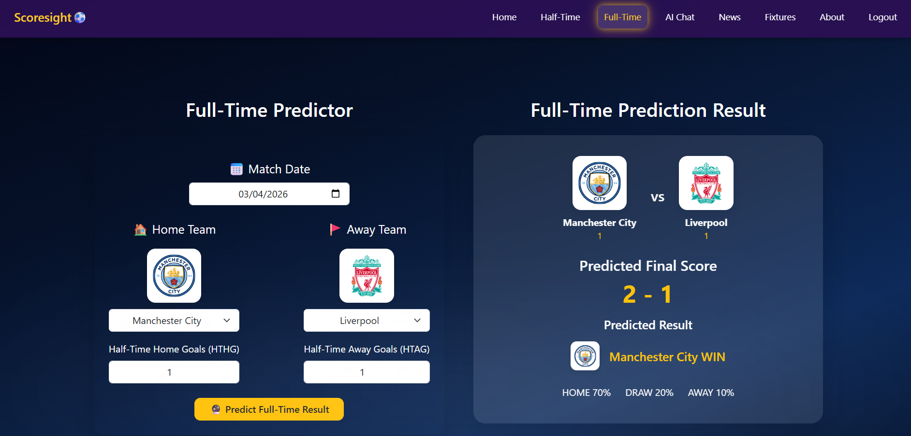
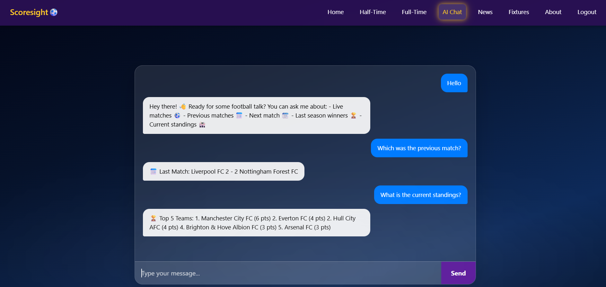
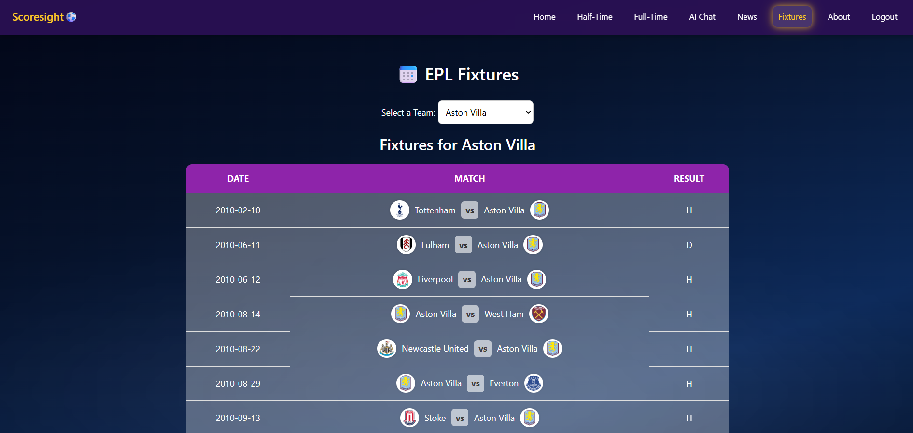
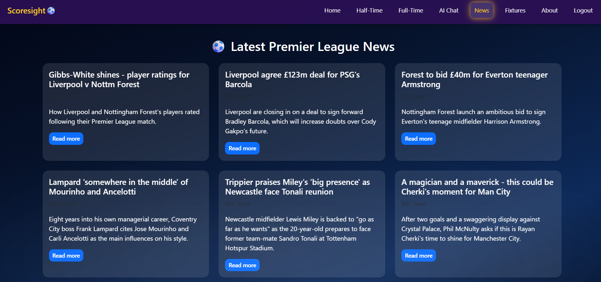

# EPL Predictor⚽ (Scoresight)

AI-driven Premier League prediction web app using Flask, Machine Learning, and real-time football APIs with an interactive dashboard.

---

## 🚀 Features

- 🔐 User Authentication (Login/Signup)
- 🤖 AI-based Match Predictions (Half-Time & Full-Time)
- 📊 Match Insights & Team Statistics
- ⚽ Upcoming Matches & Fixtures
- 🧠 AI Chat Assistant
- 📰 EPL News Integration

---
## 📸 Screenshots

### 🏠 Dashboard


### 🤖 Full-Time Match Prediction


### 🧠 AI Chat Assistant


### ⚽ EPL Fixtures


### 📰 EPL News


---
## 🧠 Tech Stack

- Python
- Flask
- Scikit-learn (Random Forest)
- Pandas & NumPy
- HTML, CSS, Bootstrap
- APIs (Football Data + AI APIs)

---

## 📦 Installation

```bash
git clone https://github.com/sushmaa-r/Scoresight.git
cd Scoresight
pip install -r requirements.txt
python app.py
```
---

## 👩‍💻 Author

Sushma R
